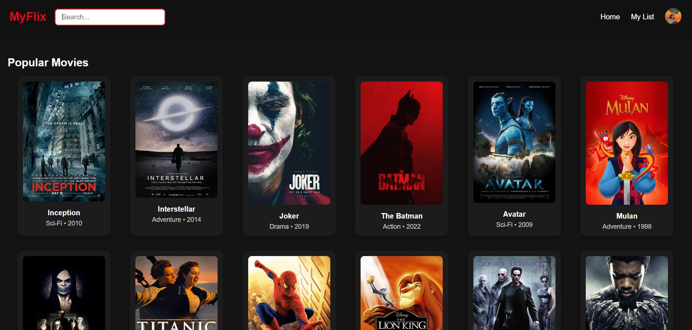
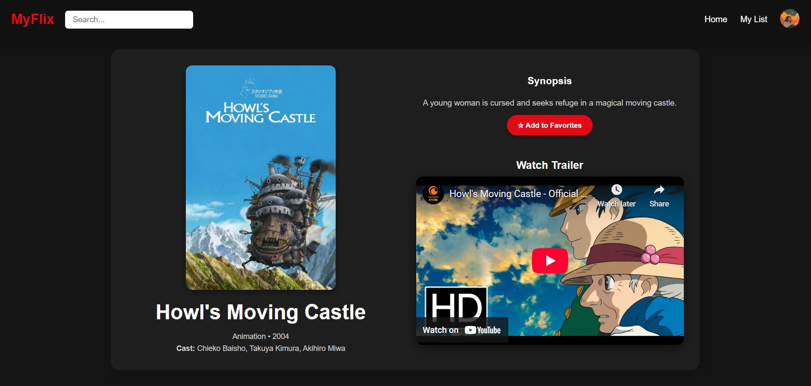

# 🎬 MyFlix (Netflix Clone)

This project is a Netflix-style movie app that allows users to browse, search and mark movies as favorites, with a clean interface and responsive design.

### 🖼️ Preview





### ✨ Watch how it works


---

## 📁 Folder Structure
```bash
frontend/
├── public/                  # Static assets (images, icons, etc.)
│   └── profile.jpg          # User profile image
├── src/
│   ├── components/          # Reusable UI components
│   │   ├── MovieCard.tsx    # Card layout for each movie
│   │   └── Navbar.tsx       # Top navigation bar
│   ├── pages/               # Page-level components
│   │   ├── Home.tsx         # Home page with movie listing
│   │   ├── MovieDetails.tsx # Detailed view of each movie
│   │   └── MyList.tsx       # User's list of favorite movies
│   ├── styles/              # CSS files for styling
│   │   ├── global.css       # Global styles
│   │   ├── MovieCard.css    # Styles for movie cards
│   │   └── Navbar.css       # Styles for the navbar
│   ├── types/               # TypeScript types
│   │   └── Movie.ts         # Movie type definition
│   ├── App.tsx              # Main application setup and routing
│   └── main.tsx             # Entry point
├── index.html               # Main HTML file
└── README.md                # Project documentation

backend/
├── src/
│   ├── controllers/         # Controllers for API endpoints
│   │   └── movie.controller.ts
│   ├── models/              # Mongoose models
│   │   └── movie.model.ts
│   └── routes               # Route definitions
│       └── movie.routes.ts
└── index.ts   # Entry point for Express server
```
---
## 🔧 Tools & Libraries Used

- Frontend: React, TypeScript

- Backend: Node.js, Express, MongoDB

- Database: MongoDB (local)

- Media: Embedded YouTube trailers

## ⚠️ Disclaimer

All movie posters, trailers, and media content used in this project belong to their respective owners.
This project is not affiliated with or endorsed by Netflix.
It was built purely for educational purposes as a Netflix clone with custom styling and features for learning frontend/backend development.

## 🔗 Useful Resources

- [React Docs](https://reactjs.org/docs/getting-started.html) – Core concepts and components.
- [TypeScript Handbook](https://www.typescriptlang.org/docs/) – Type definitions and strict typing.
- [React Router](https://reactrouter.com/en/main) – Routing between pages.
- [Express.js Guide](https://expressjs.com/en/starter/installing.html) – Server setup and routing.
- [Mongoose Docs](https://mongoosejs.com/docs/guide.html) – MongoDB object modeling.
- [MongoDB Atlas](https://www.mongodb.com/atlas/database) – Cloud MongoDB hosting.
- [YouTube Embedded Player Parameters](https://developers.google.com/youtube/player_parameters) – Embedding trailers into the app.
- [CSS Tricks](https://css-tricks.com/) – Layout, flexbox, and responsive design tips.
